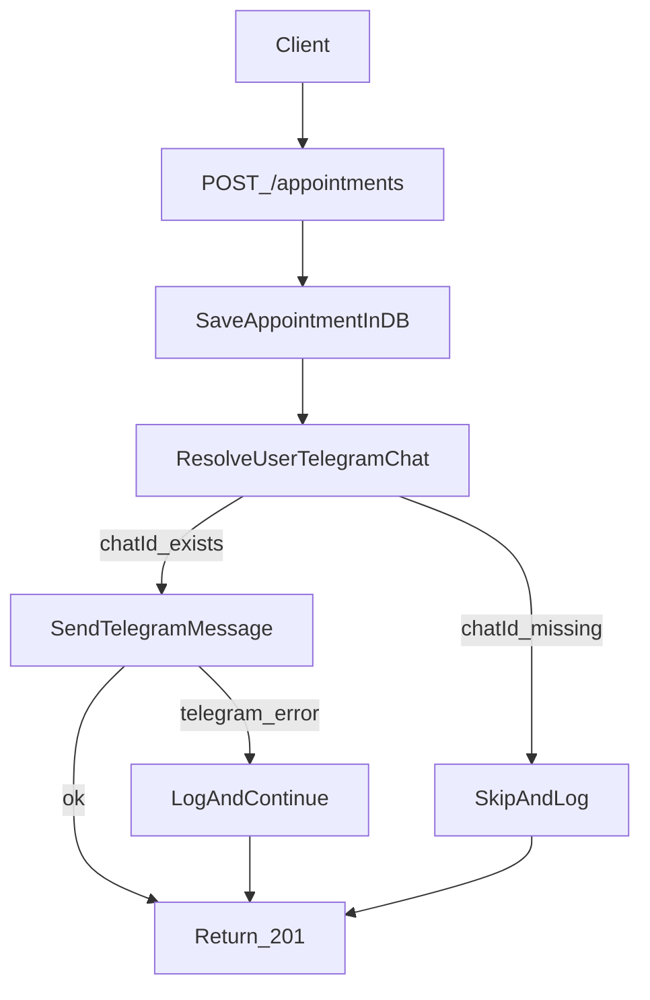

# План интеграции Telegram-уведомлений

## Текущее место в коде (куда встраиваем)

- Создание записи сейчас выполняется в `[C:/Users/Полина/service_for_the_clinic/backend/routers/appointments.py](C:/Users/Полина/service_for_the_clinic/backend/routers/appointments.py)` через `create_appointment(...)`.
- Фактическая запись в SQLite выполняется в `[C:/Users/Полина/service_for_the_clinic/backend/storage.py](C:/Users/Полина/service_for_the_clinic/backend/storage.py)` (`storage.create_appointment`).
- Конфиг читается из env в `[C:/Users/Полина/service_for_the_clinic/backend/config.py](C:/Users/Полина/service_for_the_clinic/backend/config.py)`.
- Схема БД и миграции централизованы в `[C:/Users/Полина/service_for_the_clinic/backend/database.py](C:/Users/Полина/service_for_the_clinic/backend/database.py)`.

## Целевой поток

## Какие эндпоинты добавить

- `POST /telegram/link-token` (авторизованный пользователь):
  - Генерирует одноразовый short-lived токен привязки и возвращает deep-link вида `https://t.me/<bot_username>?start=<token>`.
  - Нужен, чтобы безопасно связать пользователя в системе и его Telegram chat.
- `POST /telegram/webhook` (внешний callback от Telegram):
  - Принимает updates от бота, обрабатывает `/start <token>`.
  - Валидирует секрет webhook и привязывает `chat_id` к пользователю.
- `GET /telegram/me` (авторизованный пользователь):
  - Возвращает статус привязки (`linked: true/false`, `chat_id_masked`, `linked_at`).
  - Нужен для UI/профиля, чтобы пользователь понимал, включены ли уведомления.
- `DELETE /telegram/me` (авторизованный пользователь):
  - Отвязывает Telegram от аккаунта (очистка `chat_id`).

## Какие ключи и конфиг нужны

Добавить в `.env` и `config.py`:

- `TELEGRAM_BOT_TOKEN` — токен бота (обязательный).
- `TELEGRAM_BOT_USERNAME` — username бота для deep-link (обязательный для линковки).
- `TELEGRAM_WEBHOOK_SECRET` — секрет проверки входящих webhook (обязательный).
- `TELEGRAM_WEBHOOK_URL` — публичный URL backend для регистрации webhook (обязательный в prod).
- `TELEGRAM_NOTIFY_ENABLED=true/false` — feature flag для быстрого выключения уведомлений.
- `TELEGRAM_CONNECT_TOKEN_TTL_MINUTES=15` — TTL токена привязки.
- `TELEGRAM_HTTP_TIMEOUT_SECONDS=5` — timeout запросов к Telegram API.

## Какие изменения в БД нужны

В `users` добавить поля:

- `telegram_chat_id TEXT NULL UNIQUE`
- `telegram_linked_at TEXT NULL`

Опционально (рекомендуется) отдельная таблица аудита отправок:

- `telegram_notifications`
  - `id`, `appointment_id`, `user_id`, `chat_id`, `message_type`, `status`, `error_code`, `error_text`, `created_at`, `sent_at`
- Это упростит retry, мониторинг и диагностику.

## Где вызвать отправку уведомления

- После успешного `storage.create_appointment(...)` в `[C:/Users/Полина/service_for_the_clinic/backend/routers/appointments.py](C:/Users/Полина/service_for_the_clinic/backend/routers/appointments.py)`:
  - Получить `user_id` из созданной записи.
  - Если у пользователя есть `telegram_chat_id`, отправить уведомление через отдельный сервис-клиент (например, `telegram_client.py`).
  - Если `telegram_chat_id` отсутствует, не считать это ошибкой бизнес-операции.

## Обработка ошибок (важно)

- Принцип: **запись в клинику успешна даже при сбое Telegram**.
- Ошибки Telegram API (`400/401/403/429/5xx`, timeout, network):
  - Логировать структурированно (`appointment_id`, `user_id`, `chat_id`, тип ошибки).
  - Сохранять факт неуспешной отправки в таблицу аудита (если включена).
  - Возвращать клиенту успешный ответ по записи (`201`), без rollback записи.
- Ошибки привязки Telegram:
  - Невалидный/просроченный token привязки → `400`.
  - Повторная привязка чужого `chat_id` → `409`.
  - Невалидный webhook secret → `403`.
- Retry-политика:
  - Для `429/5xx/timeout` — ограниченный retry (например, 3 попытки с backoff).
  - Для `400/403` — без retry (ошибка данных/доступа).

## Минимальный тест-план

- Unit:
  - генерация/валидация токена привязки;
  - маппинг ошибок Telegram в внутренние статусы;
  - поведение `create_appointment` при успешной/неуспешной отправке.
- Integration:
  - `POST /appointments` создаёт запись при падении Telegram;
  - `POST /telegram/webhook` корректно привязывает `chat_id`;
  - идемпотентная обработка повторного webhook update.
- Manual:
  - пользователь получает сообщение после записи;
  - при отвязке Telegram сообщения больше не приходят.

## Порядок внедрения

1. Конфиг + env ключи.
2. Миграция БД для `telegram_chat_id`.
3. Telegram client/service слой.
4. Эндпоинты привязки (`/telegram/`*).
5. Вызов уведомления из `POST /appointments`.
6. Логирование, retry, тесты.

